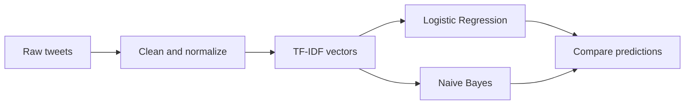

# Tweet Sentiment Classification

An NLP classification notebook that labels tweets as positive or negative using TF-IDF features and conventional machine learning models.

## Overview

The project cleans tweet text, removes noise and stop words, lemmatizes tokens, converts text into TF-IDF vectors, and compares Logistic Regression with Multinomial Naive Bayes.

It can load a custom CSV or automatically use NLTK’s balanced `twitter_samples` corpus.

## NLP Pipeline



## Data

For custom data, create `data/tweets.csv` with:

- `text`: tweet content
- `label`: `1` for positive and `0` for negative

Without that file, the notebook downloads 5,000 positive and 5,000 negative NLTK examples.

## Results

| Model | Saved test accuracy |
|---|---:|
| Logistic Regression | 75.2% |
| Multinomial Naive Bayes | 74.7% |

The saved run uses 8,000 training tweets, 2,000 test tweets, and a 5,000-feature TF-IDF representation.

## Outputs

- `output/logreg_model.joblib`
- `output/tfidf_vectorizer.joblib`
- `output/sample_predictions.csv`
- classification reports and confusion matrices

## Tech Stack

- Python
- NLTK
- Pandas and NumPy
- scikit-learn
- Matplotlib and Seaborn
- Joblib
- JupyterLab

## Project Structure

```text
.
|-- tweet_sentiment.ipynb
|-- requirements.txt
|-- .gitignore
`-- README.md
```

## Installation and Usage

```bash
git clone https://github.com/guru8880/Tweet-sentiment-classification.git
cd Tweet-sentiment-classification
python -m venv venv
```

```bash
# Windows
venv\Scripts\activate

# macOS/Linux
source venv/bin/activate
```

```bash
pip install -r requirements.txt
jupyter lab
```

Open `tweet_sentiment.ipynb` and run all cells. NLTK downloads its required corpora on the first run.

## Limitations

- The classifier handles binary sentiment only.
- Sarcasm, irony, slang, and context remain difficult.
- NLTK’s corpus may not represent current language or domain-specific tweets.

## Future Improvements

- add neutral and multi-class sentiment labels
- compare character n-grams and pretrained language models
- test robustness on more recent external datasets
- deploy the fitted model through a small API
